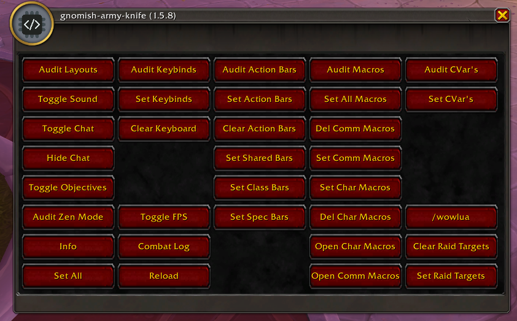

<!--
    =====================================
    generator=datazen
    version=3.2.4
    hash=c561338e644770b58f81e09ac8bd1dca
    =====================================
-->

#  gnomish-army-knife ([1.5.8](https://github.com/vkottler/gak-lua))

([gameplay demonstrations](https://www.youtube.com/playlist?list=PLKiN8hBXe1ILIVauW9mYf8gNrNoscr9Hw))

*World of Warcraft polyfills and standardization.*

---

## Documentation

* [CurseForge README](docs/curseforge.md)
* [CVar Table](docs/cvar.md)
* Keybinds
    * [GamePad](docs/gamepad_keybinds.md)
    * [Keyboard](docs/keyboard_keybinds.md)
    * [GamePad <-> Keyboard Mapping](docs/keymap.md)
* Macros
    * [Global](docs/global_macros.md)
    * [Deathknight](docs/deathknight_macros.md)
    * [Demonhunter](docs/demonhunter_macros.md)
    * [Druid](docs/druid_macros.md)
    * [Evoker](docs/evoker_macros.md)
    * [Hunter](docs/hunter_macros.md)
    * [Mage](docs/mage_macros.md)
    * [Monk](docs/monk_macros.md)
    * [Paladin](docs/paladin_macros.md)
    * [Priest](docs/priest_macros.md)
    * [Rogue](docs/rogue_macros.md)
    * [Shaman](docs/shaman_macros.md)
    * [Warlock](docs/warlock_macros.md)
    * [Warrior](docs/warrior_macros.md)
* [Action Bar Layout](docs/bars.md)
* [Various Import Strings](docs/copy_strings.md)

---

([build system](https://github.com/vkottler/gnomish-army-knife))
